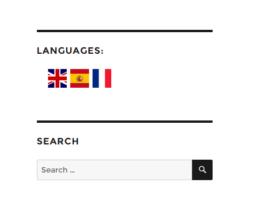

# SVG flags language switcher

This is an example of a custom WPML language switcher template created using Twig. It displays custom flags in SVG format and make it CSS styling very easy.

## Screenshot

## Installation
- Copy this template folder into `{your-theme-folder}/wpml/templates/language-switchers/`.
- Go to the WPML -> Language page and scroll to the "Menu language switcher" section.
- Add or edit a language switcher for menus
- Use the "Language switcher style" dropdown to select the "Your theme - SVG Flags" option (where "Your theme" is the name of the site's active theme) and save.